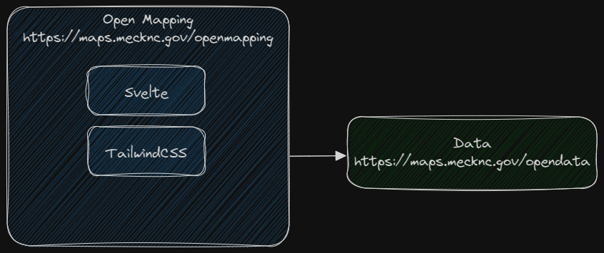

# Open Mapping


Mecklenburg County open data and maps hub, built with [Svelte](https://svelte.dev/) and [TailwindCSS](https://tailwindcss.com/). The development and build environment is [Vite](https://vitejs.dev/).

Site: [https://maps.mecklenburgcountync.gov/openmapping](https://maps.mecklenburgcountync.gov/openmapping)

## Architecture



Open Mapping is a progressive web app (PWA) consisting of three web pages - index, data, and apps. A configuration file for the data is located at [https://maps.mecklenburgcountync.gov/opendata/data.json](https://maps.mecklenburgcountync.gov/opendata/data.json). Configuration files for the apps and projects on the apps page are found in `public/json`.


# Improvements & Fixes 
- Added Disclaimer modal popup


### Hat tips

* Icons come from the excellent [phosphor](https://phosphoricons.com/).
* Big thank you to [Landing-Page](https://github.com/tailwindtoolbox/Landing-Page) for design elements and inspiration.


## Using the project

[Node.js](https://nodejs.org/en) is required to run the development and build systems, and [git](https://git-scm.com/) is required to use the versioning system.

### Clone the project
```bash
git clone https://github.com/gencharitaci/open-mapping.git
```

### Install dependencies
```bash
cd open-mapping
npm install
```

### Start the development server
```bash
npm run dev
```

Navigate a web browser to [http://localhost:3000](http://localhost:3000) to view the HMR live development server.

### Build for production
```bash
npm run build
```

After the build is complete, copy the contents of the `dist` folder to the production web server.
